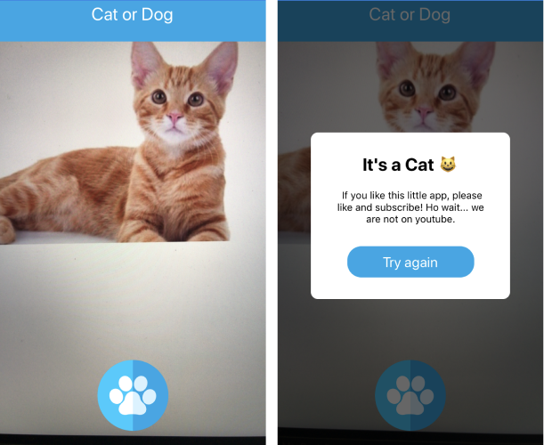

# Mobile Application For Cat or Dog Prediction
[](https://opensource.org/licenses/MIT)  

## Overview
Mobile application allowing a user to differentiate cats from dogs based on a picture.

The application runs on top of the Cat vs Dog API.

## Features
Picture taking …

Picture upload …

Showcasing the result …

## Technology 
This is a simple react native project created with react-native CLI

### Dependencies
```javascript
"dependencies": {
    "react": "16.8.3",
    "react-native": "0.59.0",
    "react-native-camera": "^3.3.0",
    "react-native-dotenv": "^0.2.0"
  }
```

## Installation NB: (developed on IOS environment, un-tested on Android )
First clone the repo on your environment. Make sure to have Xcode,  Node and react-native cli on your machine.

Set-up command:
```bash
# install all the dependencies
$ npm install

# link the camera package to the react-native project
$ React-native link react-native-camera
```

Add the following in the info.plist file 

 ios-> mobile_app->info.plist
```xml
<key>NSCameraUsageDescription</key>
<string>Your message to user when the camera is accessed for the first time</string>

<!— Include this only if you are planning to use the camera roll —>
<key>NSPhotoLibraryUsageDescription</key>
<string>Your message to user when the photo library is accessed for the first time</string>

<!— Include this only if you are planning to use the microphone for video recording —>
<key>NSMicrophoneUsageDescription</key>
<string>Your message to user when the microphone is accessed for the first time</string>
```

Create a .env file at the root of the project where you can provide the address of your server
```bash
MODEL_ADDRESS=<your url>
```

To start the application run :
```bash
$ react-native run-ios
```


